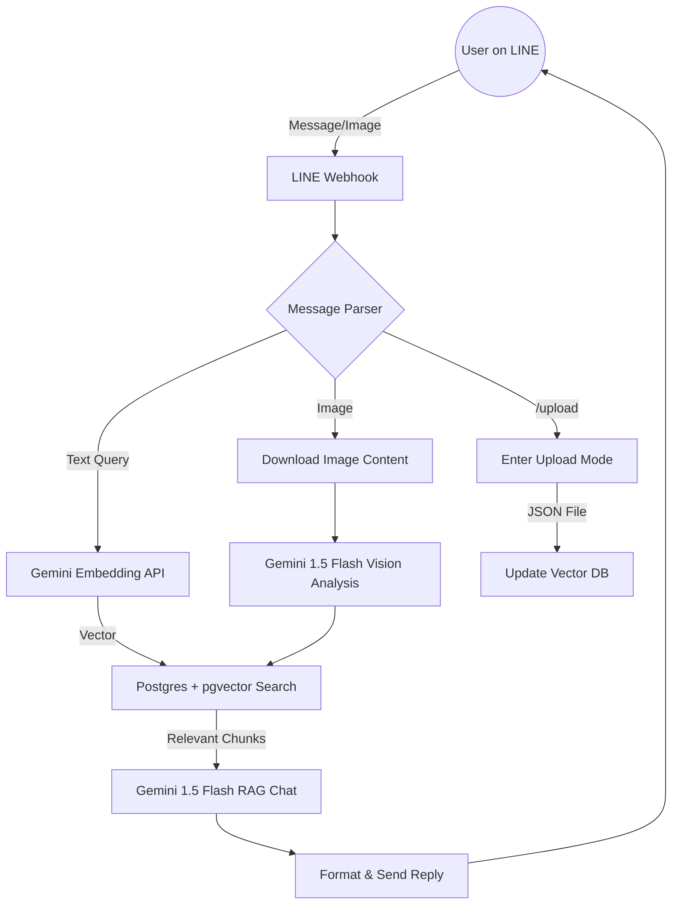

# Technical Architecture

This document details the system design and data flow of the **Line RAG Chatbot**.

## 🏗️ System Overview

The system follows a standard RAG architecture enhanced with multi-modal capabilities.

## 📊 Database Schema

The project uses three main tables in PostgreSQL:

### 1. `knowledge_base`
Stores the processed document chunks and their embeddings.
- `id`: Primary Key
- `document_name`: Source file name
- `content`: Text chunk
- `embedding`: `vector(768)` (Dimensions matching Gemini Embedding)

### 2. `chat_history`
Stores historical interactions for logging and future context.
- `user_id`: Unique LINE User ID
- `user_text`: User's original query
- `ai_reply`: AI generated response
- `source_documents`: References used for the answer

### 3. `user_sessions`
Tracks the current state of the user (e.g., waiting for image description).
- `user_id`: Unique LINE User ID
- `status`: Current FSM state (IDLE, WAITING_FOR_FILE, etc.)

## 🔍 RAG Implementation Details

1. **Embedding**: User queries are transformed into vectors using the `text-embedding-004` model.
2. **Similarity Search**: We use the `<->` (L2 Distance) or `<=>` (Cosine Similarity) operator in Postgres to find the top 5 most relevant content chunks.
3. **Augmentation**: The retrieved chunks are injected into a specialized System Prompt:
   > "Answer the user's question directly based on the 'Reference Materials'. Answer should be concise and professional..."
4. **Generation**: Gemini 1.5 Flash generates the final response based on the augmented prompt.

## 🖼️ Multi-modal Workflow

When an image is received:
1. The bot prompts the user for a description/question.
2. The image is converted to Base64 and sent to Gemini Flash for visual understanding.
3. The visual analysis result is then used as a query for the Knowledge Base to provide specific technical support related to the pictured equipment.
